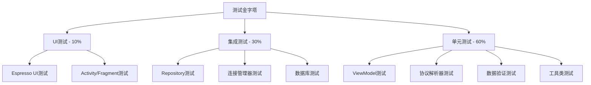

# 设计文档

## 系统架构

### 整体架构
采用MVVM（Model-View-ViewModel）架构模式，结合Repository模式进行数据管理。

```
┌─────────────────────────────────────────────────────────┐
│                      Presentation Layer                  │
│  ┌──────────────┐  ┌──────────────┐  ┌──────────────┐  │
│  │  MainActivity │  │HistoryActivity│  │SettingsActivity│ │
│  └──────────────┘  └──────────────┘  └──────────────┘  │
│         │                  │                  │          │
│  ┌──────────────┐  ┌──────────────┐  ┌──────────────┐  │
│  │SensorViewModel│  │HistoryViewModel│ │SettingsViewModel│ │
│  └──────────────┘  └──────────────┘  └──────────────┘  │
└─────────────────────────────────────────────────────────┘
                           │
┌─────────────────────────────────────────────────────────┐
│                      Business Layer                      │
│  ┌──────────────┐  ┌──────────────┐  ┌──────────────┐  │
│  │SensorRepository│  │AlarmManager  │  │SettingsManager│ │
│  └──────────────┘  └──────────────┘  └──────────────┘  │
└─────────────────────────────────────────────────────────┘
                           │
┌─────────────────────────────────────────────────────────┐
│                        Data Layer                        │
│  ┌──────────────┐  ┌──────────────┐  ┌──────────────┐  │
│  │ConnectionMgr │  │  Database    │  │SharedPreferences│ │
│  │(Bluetooth/WiFi)│ │  (Room)      │  │               │  │
│  └──────────────┘  └──────────────┘  └──────────────┘  │
└─────────────────────────────────────────────────────────┘
```

## 核心模块设计

### 1. 连接管理模块 (ConnectionManager)

**职责：** 管理与单片机系统的蓝牙/WiFi连接

**主要类：**
- `ConnectionManager` (接口)
- `BluetoothConnectionManager` (实现类)
- `WiFiConnectionManager` (实现类)
- `ConnectionState` (枚举：DISCONNECTED, CONNECTING, CONNECTED, ERROR)

**关键方法：**
```java
interface ConnectionManager {
    void scanDevices(ScanCallback callback);
    void connect(Device device, ConnectionCallback callback);
    void disconnect();
    void sendCommand(byte[] command, ResponseCallback callback);
    void setDataListener(DataListener listener);
    ConnectionState getState();
}
```

**通信协议：**
```
数据帧格式：
[帧头(2字节)] [数据长度(1字节)] [命令类型(1字节)] [数据(N字节)] [校验和(1字节)]

帧头：0xAA 0x55
命令类型：
  0x01 - 传感器数据
  0x02 - 控制命令
  0x03 - 心跳包
  0x04 - 确认应答
校验和：所有字节异或
```

### 2. 数据模型 (Data Models)

**SensorData (传感器数据实体):**
```java
@Entity(tableName = "sensor_data")
class SensorData {
    @PrimaryKey(autoGenerate = true)
    long id;
    
    long timestamp;        // 时间戳
    float temperature;     // 温度 (-40 to 80°C)
    float humidity;        // 湿度 (0 to 100%)
    int airQuality;        // 空气质量 (0 to 500)
    int lightIntensity;    // 光照强度 (0 to 100000 Lux)
}
```

**DeviceInfo (设备信息):**
```java
@Entity(tableName = "devices")
class DeviceInfo {
    @PrimaryKey
    String deviceId;       // MAC地址或IP
    
    String deviceName;     // 设备名称
    String alias;          // 用户设置的别名
    String connectionType; // "BLUETOOTH" or "WIFI"
    long lastConnected;    // 最后连接时间
}
```

**AlarmThreshold (报警阈值):**
```java
class AlarmThreshold {
    float temperatureMin;
    float temperatureMax;
    float humidityMin;
    float humidityMax;
    int airQualityMax;
    int lightIntensityMin;
    int lightIntensityMax;
}
```

### 3. 数据库设计 (Room Database)

**AppDatabase:**
```java
@Database(entities = {SensorData.class, DeviceInfo.class}, version = 1)
abstract class AppDatabase extends RoomDatabase {
    abstract SensorDataDao sensorDataDao();
    abstract DeviceInfoDao deviceInfoDao();
}
```

**SensorDataDao:**
```java
@Dao
interface SensorDataDao {
    @Insert
    void insert(SensorData data);
    
    @Query("SELECT * FROM sensor_data WHERE timestamp >= :startTime AND timestamp <= :endTime ORDER BY timestamp DESC")
    List<SensorData> getDataInRange(long startTime, long endTime);
    
    @Query("DELETE FROM sensor_data WHERE timestamp < :cutoffTime")
    void deleteOldData(long cutoffTime);
    
    @Query("SELECT * FROM sensor_data ORDER BY timestamp DESC LIMIT 1")
    SensorData getLatestData();
}
```

### 4. 数据仓库 (Repository)

**SensorRepository:**
```java
class SensorRepository {
    private SensorDataDao dao;
    private ConnectionManager connectionManager;
    private MutableLiveData<SensorData> currentData;
    
    // 启动数据接收
    void startDataCollection();
    
    // 停止数据接收
    void stopDataCollection();
    
    // 获取实时数据
    LiveData<SensorData> getCurrentData();
    
    // 获取历史数据
    List<SensorData> getHistoryData(long startTime, long endTime);
    
    // 发送控制命令
    void sendControlCommand(ControlCommand command, ResponseCallback callback);
    
    // 清理旧数据
    void cleanOldData(int retentionDays);
}
```

### 5. 报警管理 (AlarmManager)

**AlarmManager:**
```java
class AlarmManager {
    private AlarmThreshold threshold;
    private NotificationManager notificationManager;
    private long lastAlarmTime = 0;
    private static final long ALARM_INTERVAL = 5 * 60 * 1000; // 5分钟
    
    // 检查传感器数据是否超标
    void checkAlarm(SensorData data);
    
    // 发送报警通知
    private void sendAlarmNotification(String sensorType, float value);
    
    // 更新阈值
    void updateThreshold(AlarmThreshold threshold);
}
```

### 6. UI设计

#### MainActivity (主界面)
**布局结构：**
```
┌─────────────────────────────────────┐
│  [≡]  智能环境监测    [⚙] [📊]      │
├─────────────────────────────────────┤
│  连接状态: ● 已连接 (设备名称)       │
├─────────────────────────────────────┤
│  ┌─────────────┐  ┌─────────────┐  │
│  │  🌡️ 温度    │  │  💧 湿度     │  │
│  │  25.5°C     │  │  65%        │  │
│  │  更新: 1秒前 │  │  更新: 1秒前 │  │
│  └─────────────┘  └─────────────┘  │
│  ┌─────────────┐  ┌─────────────┐  │
│  │  🌫️ 空气质量 │  │  ☀️ 光照     │  │
│  │  50 AQI     │  │  1200 Lux   │  │
│  │  更新: 1秒前 │  │  更新: 1秒前 │  │
│  └─────────────┘  └─────────────┘  │
├─────────────────────────────────────┤
│  控制模块                            │
│  ┌─────────────────────────────┐   │
│  │ 显示模块    [开关]           │   │
│  │ 声光报警    [开关]           │   │
│  │ 驱动模块    [开关]           │   │
│  └─────────────────────────────┘   │
└─────────────────────────────────────┘
```

**功能：**
- 实时显示传感器数据
- 控制输出模块开关
- 显示连接状态
- 导航到历史数据和设置页面

#### HistoryActivity (历史数据界面)
**布局结构：**
```
┌─────────────────────────────────────┐
│  [←]  历史数据                       │
├─────────────────────────────────────┤
│  时间范围: [1小时▼] [导出CSV]       │
├─────────────────────────────────────┤
│  传感器类型: [温度▼]                 │
├─────────────────────────────────────┤
│  ┌─────────────────────────────┐   │
│  │                             │   │
│  │      折线图显示区域          │   │
│  │                             │   │
│  │                             │   │
│  └─────────────────────────────┘   │
├─────────────────────────────────────┤
│  数据列表:                           │
│  2024-01-15 10:30:25  25.5°C       │
│  2024-01-15 10:30:23  25.4°C       │
│  2024-01-15 10:30:21  25.3°C       │
│  ...                                │
└─────────────────────────────────────┘
```

**功能：**
- 选择时间范围和传感器类型
- 显示折线图
- 显示数据列表
- 导出CSV文件

#### SettingsActivity (设置界面)
**布局结构：**
```
┌─────────────────────────────────────┐
│  [←]  设置                           │
├─────────────────────────────────────┤
│  连接设置                            │
│  • 已保存的设备                      │
│  • 自动重连          [✓]            │
│  • 数据刷新间隔      [2秒▼]         │
├─────────────────────────────────────┤
│  报警设置                            │
│  • 启用报警通知      [✓]            │
│  • 温度阈值          [15-30°C]      │
│  • 湿度阈值          [30-70%]       │
│  • 空气质量阈值      [<150]         │
│  • 光照强度阈值      [100-5000]     │
├─────────────────────────────────────┤
│  显示设置                            │
│  • 温度单位          [摄氏度▼]      │
│  • 主题              [跟随系统▼]    │
├─────────────────────────────────────┤
│  数据管理                            │
│  • 历史数据保留      [30天▼]        │
│  • 清除所有数据                      │
│  • 导出日志                          │
└─────────────────────────────────────┘
```

### 7. 数据流设计

**实时数据流：**
```
MCU → ConnectionManager → SensorRepository → ViewModel → UI
                    ↓
                Database (后台保存)
                    ↓
                AlarmManager (检查阈值)
                    ↓
            NotificationService (发送通知)
```

**控制命令流：**
```
UI → ViewModel → SensorRepository → ConnectionManager → MCU
                                            ↓
                                    等待确认应答
                                            ↓
                                    更新UI状态
```

### 8. 线程模型

- **主线程 (UI Thread):** 仅用于UI更新
- **IO线程池:** 数据库操作、文件读写
- **网络线程:** 蓝牙/WiFi通信
- **后台线程:** 数据处理、报警检查

使用 `ExecutorService` 和 `Handler` 进行线程管理。

### 9. 权限需求

**必需权限：**
- `BLUETOOTH` - 蓝牙连接
- `BLUETOOTH_ADMIN` - 蓝牙管理
- `BLUETOOTH_CONNECT` (Android 12+) - 蓝牙连接
- `BLUETOOTH_SCAN` (Android 12+) - 蓝牙扫描
- `ACCESS_FINE_LOCATION` - 蓝牙扫描需要位置权限
- `INTERNET` - WiFi连接
- `ACCESS_WIFI_STATE` - WiFi状态
- `CHANGE_WIFI_STATE` - WiFi管理
- `POST_NOTIFICATIONS` (Android 13+) - 发送通知
- `WRITE_EXTERNAL_STORAGE` - 导出文件 (Android 10以下)

### 10. 依赖库

```gradle
dependencies {
    // AndroidX
    implementation 'androidx.appcompat:appcompat:1.6.1'
    implementation 'androidx.constraintlayout:constraintlayout:2.1.4'
    implementation 'androidx.lifecycle:lifecycle-viewmodel:2.6.2'
    implementation 'androidx.lifecycle:lifecycle-livedata:2.6.2'
    
    // Room Database
    implementation 'androidx.room:room-runtime:2.6.0'
    annotationProcessor 'androidx.room:room-compiler:2.6.0'
    
    // 图表库
    implementation 'com.github.PhilJay:MPAndroidChart:v3.1.0'
    
    // Material Design
    implementation 'com.google.android.material:material:1.10.0'
}
```

## 实现优先级

### Phase 1: 基础连接和数据显示
1. 实现蓝牙连接管理
2. 实现数据协议解析
3. 实现主界面UI
4. 实现实时数据显示

### Phase 2: 数据存储和历史查询
1. 实现Room数据库
2. 实现数据自动保存
3. 实现历史数据查询界面
4. 实现数据可视化图表

### Phase 3: 控制和报警
1. 实现远程控制功能
2. 实现报警阈值设置
3. 实现报警通知
4. 实现设置界面

### Phase 4: 高级功能
1. 实现WiFi连接支持
2. 实现数据导出
3. 实现设备管理
4. 实现日志系统

## 测试策略

### 单元测试
- ConnectionManager 连接逻辑测试
- 数据协议解析测试
- AlarmManager 报警逻辑测试
- Repository 数据操作测试

### 集成测试
- 端到端数据流测试
- 数据库操作测试
- 通知系统测试

### UI测试
- 主要界面交互测试
- 数据显示正确性测试
- 控制功能测试

## 性能优化

1. **数据库优化：** 使用索引加速查询，定期清理旧数据
2. **内存优化：** 使用分页加载历史数据，及时释放资源
3. **电池优化：** 合理设置数据刷新间隔，断开连接时停止后台任务
4. **UI优化：** 使用RecyclerView显示列表，避免过度绘制

## 安全考虑

1. **数据传输：** 考虑添加数据加密（可选）
2. **权限管理：** 运行时动态请求权限
3. **异常处理：** 全局异常捕获，防止应用崩溃
4. **数据验证：** 验证接收数据的合法性，防止异常数据

## Testing Strategy

### 测试方法概述

本应用采用**多层次测试策略**，结合单元测试、集成测试和UI测试，确保应用的功能正确性和稳定性。

**为什么不使用属性基测试（PBT）？**

虽然应用中存在一些纯函数逻辑（如协议解析、数据转换），但应用的核心功能主要包括：
- **Android UI组件和用户交互** - 不适合PBT，应使用UI测试和快照测试
- **蓝牙/WiFi硬件通信** - 涉及外部硬件，不适合PBT，应使用集成测试和模拟测试
- **数据库CRUD操作** - 简单的存储操作，不适合PBT，应使用示例基测试
- **系统通知和权限管理** - Android系统API调用，不适合PBT

因此，本应用将采用**传统的单元测试和集成测试**方法，针对少量纯函数逻辑（协议解析、数据验证）编写详细的单元测试用例。

### 测试层次



### 1. 单元测试（Unit Tests）

#### 1.1 协议解析器测试

**测试框架**：JUnit 4 + Mockito

**测试用例**：

```java
@RunWith(JUnit4.class)
public class ProtocolParserTest {
    private ProtocolParser parser;
    
    @Before
    public void setUp() {
        parser = new ProtocolParser();
    }
    
    @Test
    public void testParseValidSensorDataFrame() {
        // 测试解析有效的传感器数据帧
        byte[] validFrame = createValidSensorDataFrame(25.5f, 60, 100, 5000);
        ParsedFrame result = parser.parseFrame(validFrame);
        
        assertNotNull(result);
        assertEquals(FrameType.SENSOR_DATA, result.getType());
        assertEquals(25.5f, result.getSensorData().getTemperature(), 0.1f);
        assertEquals(60, result.getSensorData().getHumidity());
    }
    
    @Test(expected = ChecksumMismatchException.class)
    public void testParseFrameWithInvalidChecksum() {
        // 测试校验和错误的数据帧
        byte[] invalidFrame = createFrameWithInvalidChecksum();
        parser.parseFrame(invalidFrame);
    }
    
    @Test(expected = InvalidFrameException.class)
    public void testParseFrameWithInvalidHeader() {
        // 测试帧头错误的数据帧
        byte[] invalidFrame = createFrameWithInvalidHeader();
        parser.parseFrame(invalidFrame);
    }
    
    @Test
    public void testEncodeControlCommand() {
        // 测试控制命令封装
        ControlCommand command = new ControlCommand(
            CommandType.CONTROL_DISPLAY, 1, true
        );
        byte[] encoded = parser.encodeCommand(command);
        
        assertNotNull(encoded);
        assertTrue(parser.verifyChecksum(encoded));
        assertEquals(0xAA, encoded[0] & 0xFF);
        assertEquals(0x55, encoded[1] & 0xFF);
    }
    
    @Test
    public void testCRC16Calculation() {
        // 测试CRC-16校验和计算
        byte[] data = {0x01, 0x02, 0x03, 0x04};
        int crc1 = parser.calculateCRC16(data);
        int crc2 = parser.calculateCRC16(data);
        
        assertEquals(crc1, crc2); // 相同数据应产生相同校验和
    }
    
    @Test
    public void testParseEmptyFrame() {
        // 测试空数据帧
        byte[] emptyFrame = new byte[0];
        assertThrows(InvalidFrameException.class, () -> {
            parser.parseFrame(emptyFrame);
        });
    }
    
    @Test
    public void testParseTruncatedFrame() {
        // 测试截断的数据帧
        byte[] truncatedFrame = {(byte)0xAA, 0x55, 0x10}; // 不完整的帧
        assertThrows(InvalidFrameException.class, () -> {
            parser.parseFrame(truncatedFrame);
        });
    }
}
```

#### 1.2 数据验证测试

```java
@RunWith(JUnit4.class)
public class ValidationTest {
    private ValidationErrorHandler validator;
    
    @Before
    public void setUp() {
        validator = new ValidationErrorHandler();
    }
    
    @Test
    public void testValidSensorData() {
        SensorData data = new SensorData(25.5f, 60, 100, 5000);
        ValidationResult result = validator.validateSensorData(data);
        assertTrue(result.isValid());
    }
    
    @Test
    public void testTemperatureOutOfRange() {
        SensorData data = new SensorData(100.0f, 60, 100, 5000); // 温度超出范围
        ValidationResult result = validator.validateSensorData(data);
        assertFalse(result.isValid());
        assertTrue(result.getErrors().get(0).contains("温度"));
    }
    
    @Test
    public void testHumidityOutOfRange() {
        SensorData data = new SensorData(25.5f, 150, 100, 5000); // 湿度超出范围
        ValidationResult result = validator.validateSensorData(data);
        assertFalse(result.isValid());
    }
    
    @Test
    public void testValidThresholdConfig() {
        ThresholdConfig config = new ThresholdConfig(
            SensorType.TEMPERATURE, 30.0f, 10.0f
        );
        ValidationResult result = validator.validateThreshold(config);
        assertTrue(result.isValid());
    }
    
    @Test
    public void testInvalidThresholdConfig() {
        ThresholdConfig config = new ThresholdConfig(
            SensorType.TEMPERATURE, 10.0f, 30.0f // 上限小于下限
        );
        ValidationResult result = validator.validateThreshold(config);
        assertFalse(result.isValid());
    }
}
```

#### 1.3 ViewModel测试

```java
@RunWith(JUnit4.class)
public class MainViewModelTest {
    @Rule
    public InstantTaskExecutorRule instantTaskExecutorRule = 
        new InstantTaskExecutorRule();
    
    private MainViewModel viewModel;
    private ISensorDataRepository mockRepository;
    private IConnectionManager mockConnectionManager;
    
    @Before
    public void setUp() {
        mockRepository = mock(ISensorDataRepository.class);
        mockConnectionManager = mock(IConnectionManager.class);
        viewModel = new MainViewModel(mockRepository, mockConnectionManager);
    }
    
    @Test
    public void testConnectToDevice() {
        DeviceInfo device = new DeviceInfo("TEST_DEVICE", "Test Device");
        when(mockConnectionManager.connect(device))
            .thenReturn(Single.just(ConnectionResult.success()));
        
        viewModel.connectToDevice(device);
        
        verify(mockConnectionManager).connect(device);
        assertEquals(ConnectionState.CONNECTED, 
            viewModel.getConnectionState().getValue());
    }
    
    @Test
    public void testSendControlCommand() {
        ControlCommand command = new ControlCommand(
            CommandType.CONTROL_DISPLAY, 1, true
        );
        when(mockConnectionManager.sendCommand(command))
            .thenReturn(Single.just(CommandResult.success()));
        
        viewModel.sendControlCommand(command);
        
        verify(mockConnectionManager).sendCommand(command);
    }
}
```

#### 1.4 工具类测试

```java
@RunWith(JUnit4.class)
public class UtilsTest {
    @Test
    public void testCelsiusToFahrenheit() {
        assertEquals(32.0f, TemperatureUtils.celsiusToFahrenheit(0.0f), 0.1f);
        assertEquals(212.0f, TemperatureUtils.celsiusToFahrenheit(100.0f), 0.1f);
        assertEquals(98.6f, TemperatureUtils.celsiusToFahrenheit(37.0f), 0.1f);
    }
    
    @Test
    public void testFahrenheitToCelsius() {
        assertEquals(0.0f, TemperatureUtils.fahrenheitToCelsius(32.0f), 0.1f);
        assertEquals(100.0f, TemperatureUtils.fahrenheitToCelsius(212.0f), 0.1f);
    }
    
    @Test
    public void testFormatTimestamp() {
        long timestamp = 1609459200000L; // 2021-01-01 00:00:00
        String formatted = DateUtils.formatTimestamp(timestamp, "yyyy-MM-dd HH:mm:ss");
        assertEquals("2021-01-01 00:00:00", formatted);
    }
    
    @Test
    public void testBytesToHex() {
        byte[] bytes = {(byte)0xAA, 0x55, 0x01, 0x02};
        String hex = ByteUtils.bytesToHex(bytes);
        assertEquals("AA550102", hex);
    }
}
```

### 2. 集成测试（Integration Tests）

#### 2.1 数据库测试

**测试框架**：AndroidX Test + Room Testing

```java
@RunWith(AndroidJUnit4.class)
public class DatabaseTest {
    private AppDatabase database;
    private SensorDataDao sensorDataDao;
    
    @Before
    public void setUp() {
        Context context = ApplicationProvider.getApplicationContext();
        database = Room.inMemoryDatabaseBuilder(context, AppDatabase.class)
            .allowMainThreadQueries()
            .build();
        sensorDataDao = database.sensorDataDao();
    }
    
    @After
    public void tearDown() {
        database.close();
    }
    
    @Test
    public void testInsertAndQuerySensorData() {
        SensorData data = new SensorData(25.5f, 60, 100, 5000);
        data.setTimestamp(System.currentTimeMillis());
        data.setDeviceId("TEST_DEVICE");
        
        long id = sensorDataDao.insert(data);
        assertTrue(id > 0);
        
        SensorData retrieved = sensorDataDao.getById(id);
        assertNotNull(retrieved);
        assertEquals(25.5f, retrieved.getTemperature(), 0.1f);
    }
    
    @Test
    public void testQueryHistoricalData() {
        // 插入多条测试数据
        long now = System.currentTimeMillis();
        for (int i = 0; i < 10; i++) {
            SensorData data = new SensorData(20.0f + i, 50 + i, 100, 5000);
            data.setTimestamp(now - i * 60000); // 每分钟一条
            data.setDeviceId("TEST_DEVICE");
            sensorDataDao.insert(data);
        }
        
        // 查询最近5分钟的数据
        long startTime = now - 5 * 60000;
        List<SensorData> results = sensorDataDao.queryByTimeRange(
            startTime, now, "TEST_DEVICE"
        );
        
        assertEquals(6, results.size()); // 包含起始时间的数据
    }
    
    @Test
    public void testDeleteExpiredData() {
        long now = System.currentTimeMillis();
        long thirtyDaysAgo = now - 30L * 24 * 60 * 60 * 1000;
        
        // 插入过期数据
        SensorData oldData = new SensorData(20.0f, 50, 100, 5000);
        oldData.setTimestamp(thirtyDaysAgo - 1000);
        oldData.setDeviceId("TEST_DEVICE");
        sensorDataDao.insert(oldData);
        
        // 插入新数据
        SensorData newData = new SensorData(25.0f, 60, 100, 5000);
        newData.setTimestamp(now);
        newData.setDeviceId("TEST_DEVICE");
        sensorDataDao.insert(newData);
        
        // 删除过期数据
        int deleted = sensorDataDao.deleteOlderThan(thirtyDaysAgo);
        assertEquals(1, deleted);
        
        // 验证新数据仍存在
        List<SensorData> remaining = sensorDataDao.getAll();
        assertEquals(1, remaining.size());
    }
}
```

#### 2.2 Repository测试

```java
@RunWith(AndroidJUnit4.class)
public class SensorDataRepositoryTest {
    private SensorDataRepository repository;
    private AppDatabase database;
    private IConnectionManager mockConnectionManager;
    
    @Before
    public void setUp() {
        Context context = ApplicationProvider.getApplicationContext();
        database = Room.inMemoryDatabaseBuilder(context, AppDatabase.class)
            .allowMainThreadQueries()
            .build();
        mockConnectionManager = mock(IConnectionManager.class);
        repository = new SensorDataRepository(database, mockConnectionManager);
    }
    
    @Test
    public void testSaveSensorData() {
        SensorData data = new SensorData(25.5f, 60, 100, 5000);
        data.setTimestamp(System.currentTimeMillis());
        data.setDeviceId("TEST_DEVICE");
        
        TestObserver<Void> testObserver = repository.saveSensorData(data)
            .test();
        
        testObserver.assertComplete();
        testObserver.assertNoErrors();
    }
    
    @Test
    public void testExportToCSV() throws Exception {
        // 插入测试数据
        long now = System.currentTimeMillis();
        for (int i = 0; i < 5; i++) {
            SensorData data = new SensorData(20.0f + i, 50 + i, 100, 5000);
            data.setTimestamp(now - i * 60000);
            data.setDeviceId("TEST_DEVICE");
            repository.saveSensorData(data).blockingAwait();
        }
        
        // 导出CSV
        TestObserver<String> testObserver = repository.exportToCSV(
            now - 10 * 60000, 
            now, 
            Arrays.asList(SensorType.TEMPERATURE, SensorType.HUMIDITY)
        ).test();
        
        testObserver.assertComplete();
        testObserver.assertNoErrors();
        
        String csvPath = testObserver.values().get(0);
        assertNotNull(csvPath);
        
        // 验证CSV文件内容
        File csvFile = new File(csvPath);
        assertTrue(csvFile.exists());
        
        List<String> lines = Files.readAllLines(csvFile.toPath());
        assertTrue(lines.size() > 1); // 至少有标题行和一条数据
        assertTrue(lines.get(0).contains("timestamp")); // 验证标题行
    }
}
```

#### 2.3 连接管理器测试（使用模拟设备）

```java
@RunWith(AndroidJUnit4.class)
public class ConnectionManagerTest {
    private BluetoothConnectionManager connectionManager;
    private BluetoothAdapter mockBluetoothAdapter;
    
    @Before
    public void setUp() {
        mockBluetoothAdapter = mock(BluetoothAdapter.class);
        connectionManager = new BluetoothConnectionManager(mockBluetoothAdapter);
    }
    
    @Test
    public void testScanDevices() {
        // 模拟蓝牙扫描
        Set<BluetoothDevice> mockDevices = new HashSet<>();
        BluetoothDevice mockDevice = mock(BluetoothDevice.class);
        when(mockDevice.getName()).thenReturn("TEST_DEVICE");
        when(mockDevice.getAddress()).thenReturn("00:11:22:33:44:55");
        mockDevices.add(mockDevice);
        
        when(mockBluetoothAdapter.getBondedDevices()).thenReturn(mockDevices);
        
        TestObserver<List<DeviceInfo>> testObserver = 
            connectionManager.scanDevices(ConnectionType.BLUETOOTH).test();
        
        testObserver.assertNoErrors();
        List<DeviceInfo> devices = testObserver.values().get(0);
        assertEquals(1, devices.size());
        assertEquals("TEST_DEVICE", devices.get(0).getDeviceName());
    }
}
```

### 3. UI测试（UI Tests）

#### 3.1 主界面测试

**测试框架**：Espresso

```java
@RunWith(AndroidJUnit4.class)
@LargeTest
public class MainActivityTest {
    @Rule
    public ActivityScenarioRule<MainActivity> activityRule = 
        new ActivityScenarioRule<>(MainActivity.class);
    
    @Test
    public void testDisplaySensorData() {
        // 验证传感器数据显示
        onView(withId(R.id.text_temperature))
            .check(matches(isDisplayed()));
        onView(withId(R.id.text_humidity))
            .check(matches(isDisplayed()));
        onView(withId(R.id.text_air_quality))
            .check(matches(isDisplayed()));
        onView(withId(R.id.text_light_intensity))
            .check(matches(isDisplayed()));
    }
    
    @Test
    public void testConnectButton() {
        // 点击连接按钮
        onView(withId(R.id.button_connect))
            .perform(click());
        
        // 验证设备列表对话框显示
        onView(withText("选择设备"))
            .check(matches(isDisplayed()));
    }
    
    @Test
    public void testControlButtons() {
        // 验证控制按钮初始状态为禁用（未连接）
        onView(withId(R.id.button_control_display))
            .check(matches(not(isEnabled())));
        onView(withId(R.id.button_control_alarm))
            .check(matches(not(isEnabled())));
        onView(withId(R.id.button_control_driver))
            .check(matches(not(isEnabled())));
    }
    
    @Test
    public void testNavigationToHistory() {
        // 点击历史数据菜单
        onView(withId(R.id.menu_history))
            .perform(click());
        
        // 验证跳转到历史数据界面
        onView(withId(R.id.chart_temperature))
            .check(matches(isDisplayed()));
    }
}
```

#### 3.2 设置界面测试

```java
@RunWith(AndroidJUnit4.class)
@LargeTest
public class SettingsActivityTest {
    @Rule
    public ActivityScenarioRule<SettingsActivity> activityRule = 
        new ActivityScenarioRule<>(SettingsActivity.class);
    
    @Test
    public void testChangeRefreshInterval() {
        // 点击刷新间隔设置
        onView(withText("数据刷新间隔"))
            .perform(click());
        
        // 选择5秒
        onView(withText("5秒"))
            .perform(click());
        
        // 验证设置已保存
        onView(withText("数据刷新间隔"))
            .check(matches(isDisplayed()));
    }
    
    @Test
    public void testChangeTheme() {
        // 点击主题设置
        onView(withText("主题"))
            .perform(click());
        
        // 选择深色主题
        onView(withText("深色"))
            .perform(click());
        
        // 验证主题已应用（可以检查背景颜色等）
    }
}
```

### 4. 测试覆盖率目标

- **单元测试覆盖率**：≥ 80%
- **集成测试覆盖率**：≥ 60%
- **UI测试覆盖率**：≥ 40%

### 5. 持续集成

使用GitHub Actions或GitLab CI配置自动化测试：

```yaml
name: Android CI

on:
  push:
    branches: [ main, develop ]
  pull_request:
    branches: [ main, develop ]

jobs:
  test:
    runs-on: ubuntu-latest
    steps:
      - uses: actions/checkout@v2
      
      - name: Set up JDK 11
        uses: actions/setup-java@v2
        with:
          java-version: '11'
          
      - name: Grant execute permission for gradlew
        run: chmod +x gradlew
        
      - name: Run unit tests
        run: ./gradlew test
        
      - name: Run instrumentation tests
        uses: reactivecircus/android-emulator-runner@v2
        with:
          api-level: 29
          script: ./gradlew connectedAndroidTest
          
      - name: Generate test report
        run: ./gradlew jacocoTestReport
        
      - name: Upload coverage to Codecov
        uses: codecov/codecov-action@v2
```

### 6. 性能测试

#### 6.1 数据库性能测试

```java
@Test
public void testDatabaseInsertPerformance() {
    long startTime = System.currentTimeMillis();
    
    // 插入1000条数据
    for (int i = 0; i < 1000; i++) {
        SensorData data = new SensorData(20.0f + i % 50, 50 + i % 50, 100, 5000);
        data.setTimestamp(System.currentTimeMillis());
        data.setDeviceId("TEST_DEVICE");
        sensorDataDao.insert(data);
    }
    
    long endTime = System.currentTimeMillis();
    long duration = endTime - startTime;
    
    // 验证插入1000条数据不超过5秒
    assertTrue("Database insert too slow: " + duration + "ms", duration < 5000);
}
```

#### 6.2 UI响应性能测试

```java
@Test
public void testUIResponseTime() {
    long startTime = System.currentTimeMillis();
    
    onView(withId(R.id.button_connect))
        .perform(click());
    
    long endTime = System.currentTimeMillis();
    long duration = endTime - startTime;
    
    // 验证UI响应时间不超过100ms
    assertTrue("UI response too slow: " + duration + "ms", duration < 100);
}
```

### 7. 测试数据管理

#### 7.1 测试数据生成器

```java
public class TestDataGenerator {
    private static final Random random = new Random();
    
    public static SensorData generateRandomSensorData() {
        return new SensorData(
            -40 + random.nextFloat() * 120,  // 温度: -40 to 80
            random.nextInt(101),              // 湿度: 0 to 100
            random.nextInt(501),              // 空气质量: 0 to 500
            random.nextInt(100001)            // 光照: 0 to 100000
        );
    }
    
    public static List<SensorData> generateHistoricalData(int count, long startTime) {
        List<SensorData> dataList = new ArrayList<>();
        for (int i = 0; i < count; i++) {
            SensorData data = generateRandomSensorData();
            data.setTimestamp(startTime + i * 60000); // 每分钟一条
            data.setDeviceId("TEST_DEVICE");
            dataList.add(data);
        }
        return dataList;
    }
}
```

### 8. 测试最佳实践

1. **遵循AAA模式**：Arrange（准备）、Act（执行）、Assert（断言）
2. **测试命名规范**：`test<MethodName>_<Scenario>_<ExpectedResult>`
3. **使用Mock对象**：隔离外部依赖，提高测试速度
4. **测试独立性**：每个测试用例应独立运行，不依赖其他测试
5. **清理测试数据**：在`@After`方法中清理测试产生的数据
6. **使用测试夹具**：复用测试数据和配置
7. **边界值测试**：测试输入的边界值和极端情况
8. **异常路径测试**：不仅测试正常流程，也要测试异常情况


## Implementation Guidelines

### 开发阶段规划

#### 阶段1：基础架构搭建（1-2周）

**目标**：建立项目基础架构和核心组件

**任务**：
1. 配置项目依赖（Room、RxJava、MPAndroidChart等）
2. 创建数据模型和数据库Schema
3. 实现Repository模式的基础结构
4. 搭建MVVM架构框架
5. 配置日志系统

**交付物**：
- 可编译运行的项目骨架
- 数据库迁移脚本
- 基础工具类

#### 阶段2：通信模块开发（2-3周）

**目标**：实现与单片机系统的无线通信

**任务**：
1. 实现协议解析器（ProtocolParser）
2. 开发蓝牙连接管理器（BluetoothConnectionManager）
3. 开发WiFi连接管理器（WiFiConnectionManager）
4. 实现心跳机制和自动重连
5. 编写通信模块单元测试

**交付物**：
- 可正常连接和通信的蓝牙/WiFi模块
- 协议解析器单元测试（覆盖率≥80%）
- 通信模块集成测试

#### 阶段3：数据展示和存储（2周）

**目标**：实现实时数据显示和历史数据存储

**任务**：
1. 开发主界面UI（实时数据显示）
2. 实现数据存储逻辑（SensorDataRepository）
3. 实现数据过期清理机制
4. 开发历史数据查询功能
5. 编写数据层测试

**交付物**：
- 实时数据显示界面
- 历史数据存储和查询功能
- 数据库测试用例

#### 阶段4：数据可视化（1-2周）

**目标**：实现历史数据图表展示

**任务**：
1. 集成MPAndroidChart库
2. 开发折线图展示组件
3. 实现时间范围选择功能
4. 实现图表交互（缩放、平移、点击）
5. 优化图表性能

**交付物**：
- 历史数据图表界面
- 图表交互功能
- 性能测试报告

#### 阶段5：远程控制和报警（1-2周）

**目标**：实现远程控制和报警通知功能

**任务**：
1. 开发控制命令发送功能
2. 实现报警管理器（AlarmManager）
3. 开发通知服务（NotificationService）
4. 实现阈值设置界面
5. 编写报警逻辑测试

**交付物**：
- 远程控制功能
- 报警通知功能
- 阈值设置界面

#### 阶段6：数据导出和设备管理（1周）

**目标**：实现数据导出和设备管理功能

**任务**：
1. 开发CSV导出功能
2. 实现设备列表管理
3. 实现设备快速连接
4. 开发应用设置界面
5. 实现权限管理

**交付物**：
- 数据导出功能
- 设备管理界面
- 应用设置界面

#### 阶段7：测试和优化（1-2周）

**目标**：全面测试和性能优化

**任务**：
1. 完善单元测试和集成测试
2. 执行UI测试
3. 性能优化（内存、电量、响应速度）
4. 修复已知Bug
5. 代码审查和重构

**交付物**：
- 完整的测试报告
- 性能优化报告
- Bug修复列表

#### 阶段8：发布准备（1周）

**目标**：准备应用发布

**任务**：
1. 编写用户文档
2. 准备应用商店素材（截图、描述）
3. 配置混淆规则
4. 生成签名APK
5. 内部测试和验收

**交付物**：
- 用户手册
- 发布版APK
- 测试报告

### 技术选型说明

#### 1. 为什么选择MVVM架构？

- **关注点分离**：UI逻辑与业务逻辑分离，提高可维护性
- **可测试性**：ViewModel可独立测试，无需依赖Android框架
- **生命周期感知**：LiveData自动处理生命周期，避免内存泄漏
- **Google推荐**：Android官方推荐的架构模式

#### 2. 为什么选择Room数据库？

- **类型安全**：编译时SQL验证，减少运行时错误
- **简洁API**：相比原生SQLite，代码量减少约50%
- **LiveData集成**：支持响应式数据查询
- **迁移支持**：提供数据库版本迁移机制

#### 3. 为什么选择RxJava？

- **异步处理**：简化异步操作和线程切换
- **操作符丰富**：提供map、filter、debounce等强大操作符
- **错误处理**：统一的错误处理机制
- **可组合性**：易于组合多个异步操作

**备选方案**：Kotlin Coroutines（如果使用Kotlin）

#### 4. 为什么选择MPAndroidChart？

- **功能完善**：支持多种图表类型和交互
- **性能优秀**：可流畅展示大量数据点
- **文档齐全**：有详细的文档和示例
- **社区活跃**：GitHub上有大量问题解答

### 代码规范

#### 1. 命名规范

**类命名**：
- Activity：`<Feature>Activity`（如`MainActivity`、`SettingsActivity`）
- Fragment：`<Feature>Fragment`（如`SensorDataFragment`）
- ViewModel：`<Feature>ViewModel`（如`MainViewModel`）
- Repository：`<Domain>Repository`（如`SensorDataRepository`）
- Adapter：`<Feature>Adapter`（如`DeviceListAdapter`）

**方法命名**：
- 获取数据：`get<Property>()`（如`getTemperature()`）
- 设置数据：`set<Property>()`（如`setTemperature()`）
- 布尔判断：`is<Property>()`或`has<Property>()`（如`isConnected()`）
- 事件处理：`on<Event>()`（如`onDataReceived()`）

**资源命名**：
- Layout：`<type>_<feature>.xml`（如`activity_main.xml`、`fragment_history.xml`）
- ID：`<type>_<description>`（如`button_connect`、`text_temperature`）
- String：`<feature>_<description>`（如`main_title`、`error_connection_failed`）
- Color：`<description>`（如`primary_color`、`error_red`）

#### 2. 代码组织

**包结构**：
```
com.example.smartmonitor
├── data
│   ├── local
│   │   ├── dao
│   │   ├── database
│   │   └── entity
│   ├── remote
│   │   ├── bluetooth
│   │   ├── wifi
│   │   └── protocol
│   └── repository
├── domain
│   ├── model
│   └── usecase
├── presentation
│   ├── main
│   ├── history
│   ├── settings
│   └── common
├── service
│   ├── alarm
│   ├── notification
│   └── export
└── util
```

#### 3. 注释规范

**类注释**：
```java
/**
 * 传感器数据仓库
 * 
 * 负责协调本地数据库和远程数据源，提供统一的数据访问接口。
 * 
 * @author Your Name
 * @since 1.0.0
 */
public class SensorDataRepository implements ISensorDataRepository {
    // ...
}
```

**方法注释**：
```java
/**
 * 查询历史数据
 * 
 * @param startTime 开始时间戳（毫秒）
 * @param endTime 结束时间戳（毫秒）
 * @param sensorType 传感器类型，null表示查询所有类型
 * @return 历史数据列表的Single
 * @throws IllegalArgumentException 如果时间范围无效
 */
public Single<List<SensorData>> queryHistoricalData(
    long startTime, 
    long endTime, 
    @Nullable SensorType sensorType
) {
    // ...
}
```

### 性能优化建议

#### 1. 内存优化

- **使用ViewHolder模式**：RecyclerView中复用视图
- **及时释放资源**：在onDestroy中关闭连接、取消订阅
- **避免内存泄漏**：使用WeakReference、避免静态引用Activity
- **图片优化**：使用适当的图片尺寸和格式

#### 2. 电量优化

- **批量操作**：批量写入数据库，减少I/O次数
- **合理的刷新间隔**：默认2秒，允许用户调整
- **后台限制**：应用进入后台时降低刷新频率
- **使用JobScheduler**：延迟非紧急任务

#### 3. 网络优化

- **连接池**：复用蓝牙/WiFi连接
- **超时设置**：合理的连接和读取超时时间
- **重试机制**：指数退避重试策略
- **心跳优化**：根据网络状况动态调整心跳间隔

#### 4. UI优化

- **异步加载**：耗时操作在后台线程执行
- **懒加载**：延迟加载非关键UI组件
- **减少过度绘制**：优化布局层级
- **使用ConstraintLayout**：减少嵌套，提高性能

### 安全考虑

#### 1. 数据安全

- **本地数据加密**：敏感数据使用SQLCipher加密
- **通信加密**：考虑在协议层添加加密（如AES）
- **权限最小化**：只请求必要的权限

#### 2. 代码安全

- **代码混淆**：使用ProGuard/R8混淆代码
- **防止逆向**：关键算法使用Native代码
- **输入验证**：验证所有外部输入

#### 3. 网络安全

- **证书验证**：WiFi连接时验证服务器证书
- **防重放攻击**：命令帧中添加时间戳和序列号
- **访问控制**：设备配对验证

### 可访问性

#### 1. 内容描述

为所有UI元素添加contentDescription：
```xml
<ImageButton
    android:id="@+id/button_connect"
    android:contentDescription="@string/desc_connect_button"
    ... />
```

#### 2. 文字大小

支持系统字体缩放：
```xml
<TextView
    android:textSize="16sp"
    ... />
```

#### 3. 颜色对比

确保文字和背景有足够的对比度（WCAG AA标准：4.5:1）

#### 4. 触摸目标

按钮和可点击元素最小尺寸48dp × 48dp

### 国际化

#### 1. 字符串资源

所有用户可见文本使用字符串资源：
```xml
<!-- strings.xml -->
<string name="app_name">智能环境监测</string>
<string name="main_title">实时监测</string>
<string name="error_connection_failed">连接失败，请重试</string>
```

#### 2. 多语言支持

创建不同语言的资源文件：
- `values/strings.xml`（默认，中文）
- `values-en/strings.xml`（英文）

#### 3. 日期和数字格式

使用系统格式化工具：
```java
DateFormat dateFormat = DateFormat.getDateTimeInstance(
    DateFormat.MEDIUM, 
    DateFormat.MEDIUM, 
    Locale.getDefault()
);
String formattedDate = dateFormat.format(new Date());
```

### 文档要求

#### 1. 代码文档

- 所有公共API必须有Javadoc注释
- 复杂算法需要详细注释说明
- 重要的业务逻辑需要注释

#### 2. 用户文档

- 用户手册（功能说明、操作指南）
- 常见问题FAQ
- 故障排除指南

#### 3. 开发文档

- 架构设计文档（本文档）
- API文档（自动生成）
- 部署文档

## Summary

本技术设计文档为智能环境监测Android应用提供了完整的架构设计和实现指南。

### 核心设计决策

1. **架构模式**：采用MVVM架构，结合Repository模式，确保代码的可维护性和可测试性
2. **通信协议**：定义了完整的数据帧格式，支持蓝牙和WiFi两种连接方式
3. **数据持久化**：使用Room数据库，支持最长60天的历史数据存储
4. **数据可视化**：使用MPAndroidChart库实现折线图展示
5. **报警机制**：基于用户设定的阈值，实时监控并触发报警通知
6. **错误处理**：分类处理各种错误场景，提供友好的用户反馈

### 技术亮点

- **响应式编程**：使用RxJava处理异步操作和数据流
- **生命周期感知**：使用LiveData自动管理UI更新
- **模块化设计**：各组件职责清晰，低耦合高内聚
- **完善的测试**：单元测试、集成测试、UI测试全覆盖
- **性能优化**：内存、电量、网络多方面优化
- **安全考虑**：数据加密、代码混淆、权限管理

### 质量保证

- **测试覆盖率**：单元测试≥80%，集成测试≥60%，UI测试≥40%
- **代码规范**：遵循Android官方代码规范和最佳实践
- **持续集成**：自动化测试和代码质量检查
- **性能监控**：内存、电量、响应时间等性能指标

### 后续扩展

本设计为未来功能扩展预留了空间：

1. **多设备支持**：同时连接和监控多个单片机系统
2. **云端同步**：将数据同步到云端，支持跨设备访问
3. **数据分析**：基于历史数据的趋势分析和预测
4. **智能控制**：根据环境参数自动控制输出模块
5. **语音控制**：集成语音助手，支持语音查询和控制
6. **地理位置**：记录数据采集的地理位置
7. **分享功能**：支持将数据和图表分享到社交媒体

### 开发时间估算

- **总开发时间**：10-14周
- **核心功能**：6-8周
- **测试和优化**：2-3周
- **发布准备**：1周
- **缓冲时间**：1-2周

### 团队配置建议

- **Android开发工程师**：2人（负责应用开发）
- **测试工程师**：1人（负责测试用例编写和执行）
- **UI/UX设计师**：1人（负责界面设计）
- **项目经理**：1人（负责项目管理和协调）

### 风险评估

| 风险 | 影响 | 概率 | 缓解措施 |
|------|------|------|----------|
| 蓝牙连接不稳定 | 高 | 中 | 实现健壮的重连机制，增加心跳检测 |
| 协议解析错误 | 高 | 中 | 完善的错误处理和日志记录，充分测试 |
| 数据库性能问题 | 中 | 低 | 定期清理过期数据，优化查询语句 |
| 权限被拒绝 | 中 | 中 | 提供清晰的权限说明，引导用户授权 |
| 内存泄漏 | 中 | 低 | 代码审查，使用LeakCanary检测 |
| 电量消耗过高 | 中 | 中 | 优化刷新频率，后台限制 |

### 结论

本设计文档提供了一个完整、可行的技术方案，涵盖了从架构设计到实现细节的各个方面。通过遵循本文档的指导，开发团队可以高效地构建一个功能完善、性能优秀、用户体验良好的智能环境监测Android应用。

设计强调了代码质量、可测试性和可维护性，为项目的长期发展奠定了坚实的基础。同时，设计也考虑了未来的扩展性，为后续功能迭代预留了空间。

---

**文档版本**：1.0.0  
**最后更新**：2024年  
**状态**：待审核
